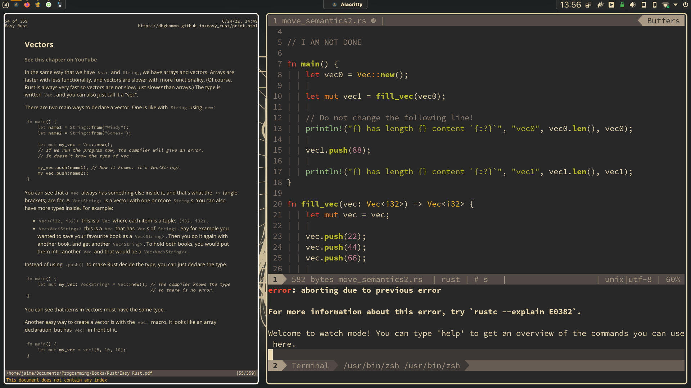

# KDE 3 Ways - Gruvbox

my linux desktop customization files

this config is used on my KDE Plasma desktop + [i3-gaps, bspwm, xmonad] as the window manager(s)

## SCREENSHOTS

## SETUP

- VSCodium theme: gruvbox material dark
- plasma theme: gruvbox
- gtk theme: gruvbox material dark
- dock/bar: latte-dock

## INSTALLATION (WIP - not tested)

**DO NOT TRY THIS**

- clone the repo
  if on arch or arch based distro:
- run `./setup.sh`
  if on other distro:
- install the packages manually
- run `./setup.sh --not-arch`
